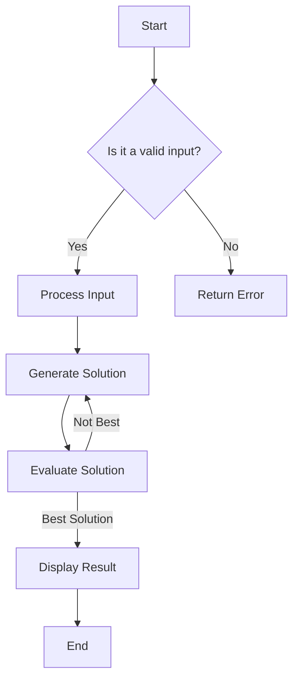

```mermaid
flowchart TD
    A[Start] --> B{Is it a valid input?}
    B -- Yes --> C[Process Input]
    B -- No --> D[Return Error]
    C --> E[Generate Solution]
    E --> F[Evaluate Solution]
    F -->|Best Solution| G[Display Result]
    F -->|Not Best| E
    G --> H[End]
```